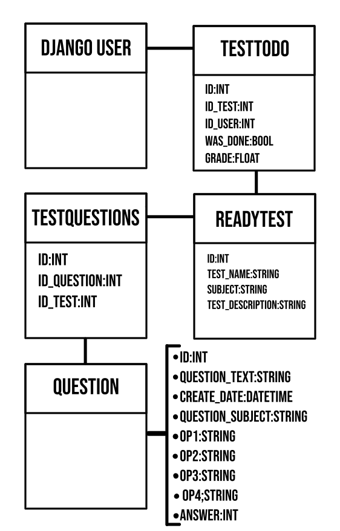

# Rodando o Projeto

---

- Clone o projeto na sua maquina:

  ```bash
  git clone https://github.com/Rafael-Benicio/django_prova_fundamental
  ```

- Instale as dependencias:

  ```bash
  pip install -r requirements.txt
  ```

- Configure as variaveis de ambiente para o acesso do banco postgres:

  ```bash
  export PGNAME='####'
  export PGUSER='####'
  export PGPASSWORD='####'
  export PGHOST='####'
  export PGPORT='####'

  ```

- Faz as configurações de variaveis relativas ao Django

  ```bash
  export SECRET_KEY='####'
  export DEBUG='####'
  ```

  > Ou então configure um de sua preferencia no arquivo `testForFundamental/settings.py`

- Rode as migrations:

  ```bash
  python3 manage.py migrate
  ```

- Crie um super usuário, para poder adicionar no banco de dados, tanto novos estudantes, quanto as provas que eles devem fazer

  ```bash
  python3 manage.py createsuperuser
  ```

- Por fim rode o servido de desenvolvimento com:

  ```
  python3 manage.py runserver
  ```

  ## Estrutura da model em school_test

  
